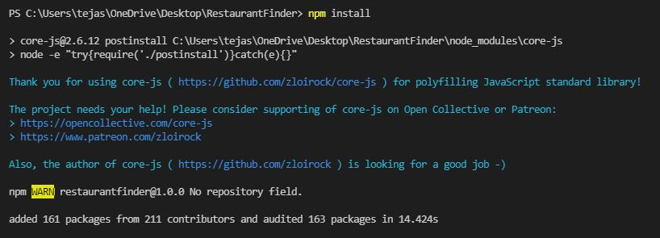
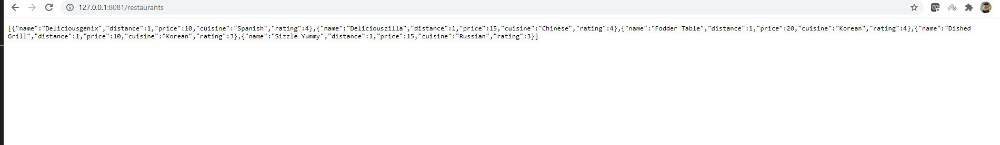
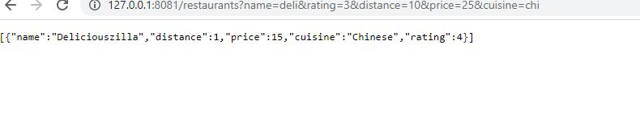
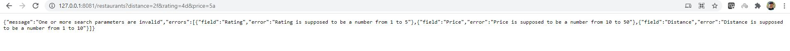
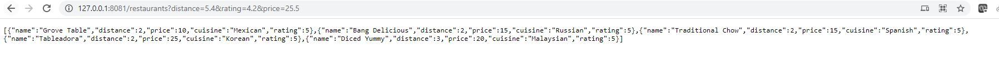

<h1>Restaurant Finder App</h1>

    This app is developed in node js. This application doesn't have UI and only has a backend server. The entire development of this project is done in windows.
  
<h3>Prerequisites and steps to run</h3>

 * Install node js by from here https://nodejs.org/en/download/ by chosing the appropriate option for your operating system.  
 * Clone this repository and run `npm install` in this repository from the command line (terminal). It will install all the dependencies, as shown below. This will create a node modules folder in the directory. 
 * Run `node app.js` to start the node js server. This will start the server on 127.0.0.1:8081.
    
 * To search for the api use the following URL  
    `localhost:8081/restaurants?name=restaurantName&rating=customerRating&distance=restaurantDistance&price=price&cuisine=cusinieName`
 * A sample url is http://localhost:8081/restaurants?name=deli&rating=3&distance=10&price=25&cuisine=chi. Copy this URL to any web browser to test it. Postman can also be used to test this URL. Postman can be downloaded from here https://www.postman.com/downloads/.
 * Here all the query strings are optional, if no query strings are provided and you just use the url localhost:8081/restaurants, then it will give you the top 5 closest restaurants from the given list of restaurants in CSV.

 <h3>Testing Examples</h3>
 
 * API request without any search criteria. URL: http://127.0.0.1:8081/restaurants. 
 * API request with all the search parameters. URL: http://127.0.0.1:8081/restaurants?name=deli&rating=3&distance=10&price=25&cuisine=chi. 
 * API request with invalid search citeria. URL: http://127.0.0.1:8081/restaurants?distance=2f&rating=4d&price=5a. 
 * API request with decimal price, distance, rating. URL: http://127.0.0.1:8081/restaurants?distance=5.4&rating=4.2&price=25.5. 

 <h3>Assumptions made</h3>
 
 * RestaurantName and Cuisine are always valid. If some random string provided is not a match or partial match for these fields, then no restaurants will be filtered.
 * For the criteria Name and cuisine, this API filters out a partial match if it is a substring of the actual cuisine or name in the restaurants.csv file. This is case insensitive.
 * The API throws an error if the Rating is not an integer in the range 1 - 5.
 * The API thows an error if the Price is not in the range 10 - 50.
 * The distance citeria should be a number in the range 1- 10.
